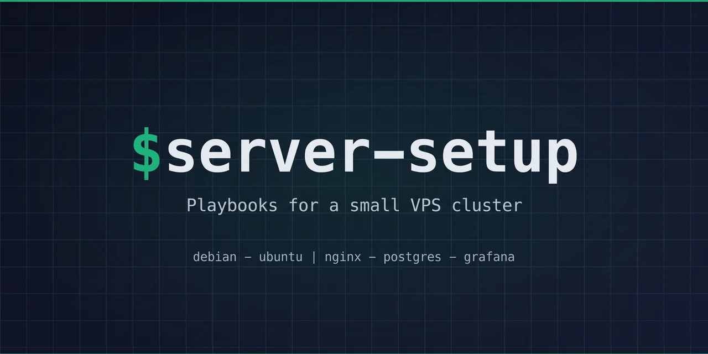

[](https://github.com/lionel-panhaleux/server-setup/actions/workflows/test.yml)

[pyinfra](https://pyinfra.com) deploys for Debian/Ubuntu servers: base packages, SSH hardening, UFW, nginx + certbot, a backed-up postgres cluster and observability. It is also the `server_setup` Python package whose `nginx_site` and `postgres_db` deploys the apps call from their own repos.

Apps still on Ansible pin the `ansible-final` tag, the last release of the `lionel_panhaleux.server_setup` collection.

## Prerequisites

- [uv](https://docs.astral.sh/uv/), [just](https://just.systems/) and [sops](https://getsops.io/)
- [gh](https://cli.github.com/), authenticated, for pushing deploy targets to GitHub
- (optional) [pre-commit](https://pre-commit.com/) hooks: `pre-commit install` once per clone

## Layout

```
inventory.py        hosts, and what differs between them
group_data/all.py   how every host is reached: deploy user and key, known_hosts, sudo
known_hosts         each host's SSH key; every connection checks it strictly
secrets.sops.yaml   encrypted secrets (sops, recipients in .sops.yaml)
deploys/            setup.py, upgrade.py, reboot.py, postgres_upgrade.py, add_admin.py
server_setup/       the package: one module per concern, its files and templates
deploy_targets.py   which repo deploys to which host
```

## Secrets

`secrets.sops.yaml` holds every secret, encrypted to the SSH public keys in `.sops.yaml` (sops uses them as age recipients). Identifiers (`*_user`, `*_access_key`) stay readable next to the secret they pair with. sops decrypts with `~/.ssh/id_ed25519` by default; set `SOPS_AGE_SSH_PRIVATE_KEY_FILE` to use another key, such as `~/.ssh/deploy`. Edit it in place:

```bash
just secrets
```

To add a recipient (a new admin), add its SSH public key to `.sops.yaml` and run `sops updatekeys secrets.sops.yaml`.

## Usage

### 1. Generate SSH keys

One ed25519 keypair per identity. Leave the deploy key without a passphrase (CI cannot type one); set one for admin keys.

```bash
ssh-keygen -t ed25519 -f ~/.ssh/alice -C "alice@$(hostname)"
ssh-keygen -t ed25519 -f ~/.ssh/deploy     -C "deploy@server-setup" -N ""
```

### 2. Add a new host

Record its SSH key, then create the admin users as root:

```bash
just add-host 1.2.3.4
ADMIN=alice  ADMIN_KEY=~/.ssh/alice.pub  just add-admin 1.2.3.4
ADMIN=deploy ADMIN_KEY=~/.ssh/deploy.pub just add-admin 1.2.3.4
```

Root logs in with `~/.ssh/id_ed25519`; pass another key as a second argument (`just add-admin 1.2.3.4 ~/.ssh/other`).

Then add it to `inventory.py`, commit `known_hosts`, and `just sync` so the apps' CI trusts the key too.

### 3. System setup

```bash
just setup frankfurt            # shows every change with its diff, then asks
just setup frankfurt --dry      # only shows
just setup servers              # every host
```

Setup disables root SSH login. A run that ends with `REBOOT REQUIRED` needs a reboot (see 5).

A fresh box needs a second run: postgres logging is configured from the `conf.d` directory, which only exists once the first run has installed postgresql.

### 4. Distribution upgrade

```bash
just upgrade frankfurt              # reports the release available
CONFIRM=1 just upgrade frankfurt    # upgrades and reboots
```

### 5. Kernel reboot

unattended-upgrades installs security updates, kernels included, but never reboots: tournaments run in every time zone, so no hour is safe to pick blindly. Each host exports `node_reboot_required` (1 while a reboot is pending) to Grafana, refreshed hourly; alert on it and reboot when convenient:

```bash
just reboot frankfurt               # reboots only if required, then checks every unit came back
FORCE=1 just reboot frankfurt       # reboots anyway
```

### 6. Postgres major upgrade (untested)

A new major arrives with a distro upgrade on Debian's packages, or with a new `packages(postgres_version=)` on PGDG. Either way the package creates an empty `NEW/main` on port 5433 beside the running `OLD/main`, and nothing migrates until:

```bash
just pg-upgrade frankfurt                       # reports what it would do
CONFIRM=1 just pg-upgrade frankfurt             # backs up, drops the empty NEW/main, pg_upgradecluster OLD main
just setup frankfurt                            # writes the new cluster's conf.d
CONFIRM=1 DROP_OLD=1 just pg-upgrade frankfurt  # once the apps are checked: drops OLD/main and its packages
```

`pg_upgradecluster` runs in dump mode: the apps are down for the dump and restore, and `OLD/main` stays intact on 5433, so until `DROP_OLD` the rollback is to stop `NEW/main` and start `OLD/main`. **This runbook has never run**: read it against `server_setup/maintenance.py` before the first use.

## Deploy targets

Apps deploy from their own repos; [OPERATIONS.md](OPERATIONS.md) lists which repo deploys what, and how. `deploy_targets.py` maps each GitHub repo to an inventory host and a GitHub environment:

```bash
just sync                   # DEPLOY_HOST and DEPLOY_HOST_KEY to every target
just sync-key ~/.ssh/deploy # DEPLOY_SSH_KEY to every target
```

## GitHub Actions

`setup.yml` and `upgrade.yml` run on `workflow_dispatch`, with the host as a dropdown. They read `DEPLOY_SSH_KEY` from the repo secrets and check host keys against the committed `known_hosts`. `setup.yml` decrypts the secrets with that same key, which `.sops.yaml` lists as the `deploy` recipient.

`test.yml` lints, runs the unit tests, has the runner's nginx accept every `nginx_site` variant (`nginx -t`), checks the hardened `sshd_config`, and converges `postgres_db` twice on the runner itself.

## Reusable deploys

An app adds the package to its deploy dependencies, pinned to a tag:

```toml
[dependency-groups]
deploy = ["server-setup @ git+https://github.com/lionel-panhaleux/server-setup@v2.0.0"]
```

and calls it from its own pyinfra deploy:

```python
from server_setup import nginx_site, postgres_db

postgres_db(database="krcg", owner="krcg")
nginx_site(site="krcg_api", domain="api.krcg.org", type="proxy", upstream="http://127.0.0.1:8000")
```

### `nginx_site`

An nginx site with automatic Let's Encrypt issuance and journald logging:

- `static`: files from `root` (cached 5 minutes, images and fonts an hour)
- `spa`: static with an `index.html` fallback; `/assets/` (Vite's hashed files) cached a year, everything else revalidated
- `proxy`: reverse proxy to `upstream` (a localhost port or a unix socket)

Options: `aliases` (more `server_name`s, on the certificate too), `cert_extra_domains` (on the certificate only), `open_api_paths` (path prefixes with permissive CORS; `("/",)` for the whole site), `plain_http_paths` (served over plain HTTP instead of redirecting), `client_max_body_size` (default `10m`), `extra_locations` (raw nginx appended to the HTTPS server).

`public=True` (static or spa) is for files anyone may link to (`static.krcg.org`, `lackey.krcg.org`): every response carries read-only CORS, directories are listed, and port 80 serves the site exactly as 443 does, `extra_locations` included. An extra location with its own `add_header` inherits none from the server, so it must repeat the CORS headers.

Every site sends `X-Content-Type-Options: nosniff`, and over HTTPS `Strict-Transport-Security: max-age=31536000` (this host only: no `includeSubDomains`, which would force HTTPS on plain-HTTP neighbours). The proxy passes the client address as `X-Forwarded-For`, never a chain the client sent. TLS follows Mozilla's intermediate profile.

`site` must be alphanumeric or underscore: it names the config file and tags the site's logs.

```bash
journalctl -t krcg_api -f
```

### `certificate`

A Let's Encrypt certificate for an app that writes its own vhosts: `certificate("archon.krcg.org", ("www.archon.krcg.org",))`, then put the vhost. It issues only when the certificate is missing, lacks a name, or renews through another webroot, and reloads nginx afterwards. Until a site claims a name, the host's default server answers its HTTP-01 challenge; afterwards, renewals need the site's own port-80 server to keep serving `/.well-known/acme-challenge/` from `/var/www/certbot`.

### `postgres_db`

A database and its owning role, with web-app timeouts: `statement_timeout=15s`, `idle_in_transaction_session_timeout=60s`, `lock_timeout=5s` (override per app, or per transaction with `SET LOCAL statement_timeout = '10min'` for batch jobs). Apps on the same host log in over the unix socket by peer auth, so `password` is optional. The cluster-wide backup picks the database up on its next run.

### Restore

Restore is destructive: it drops and recreates the database. On the host, from the latest remote snapshot, a given one, or a local dump:

```bash
sudo -u postgres pg-restore krcg krcg
sudo -u postgres pg-restore krcg krcg 3a1b9f2c
sudo -u postgres pg-restore krcg krcg /var/backups/postgres/krcg-20260421T030000.dump
```

The recreated database has no timeouts until the app's deploy runs `postgres_db` again.

## Cluster-wide postgres backup

`postgres-backup.timer` runs `/usr/local/bin/pg-backup` daily. It dumps every non-template database to `/var/backups/postgres/<db>-<timestamp>.dump` (pg_dump's custom format), dumps the cluster globals (`pg_dumpall --globals-only`: login roles, password hashes, memberships; without them a full-cluster restore has no roles for the apps to connect as), and prunes local files older than 7 days.

Each dump is also pushed with [restic](https://restic.net) to Scaleway Object Storage, one repository per database at `s3:<endpoint>/<bucket>/<db>`, kept 7 daily, 4 weekly and 12 monthly. restic encrypts and deduplicates; repositories are created on first use. Local pruning runs whether or not the upload succeeded.

A host's `backup_exclude` in `inventory.py` lists ephemeral databases to skip: scratch and reseeded databases churn near-full-size snapshots for backups nothing will ever restore.

One database failing doesn't stop the others; the script exits nonzero so `systemctl status postgres-backup` surfaces it. A dropped or excluded database's restic repository is never pruned again, so the nightly run ends with an orphan scan (rclone lists the bucket's prefixes) that logs a warning per repository without a backed-up database, unless an app declared it its own in `/etc/postgres-backup/repos.d/`; deleting one (`rclone purge` its prefix) stays a manual act.

The secrets: `remote_backup_access_key` and `remote_backup_secret_key` (a Scaleway IAM key scoped to the bucket) and `remote_backup_restic_password` (losing it means losing the backups).

### Weekly restore-verify

`postgres-backup-check.timer` runs `restic check --read-data-subset=1/10` per repository and round-trips the latest snapshot into a throwaway `pg_check_<db>` database that must contain at least one user table, catching dumps that exist but don't restore. A free-space guard skips (and fails) the round-trip rather than fill the disk.

### Failure alerting

Both scripts ping a [healthchecks.io](https://healthchecks.io)-style URL: `GET <url>` on success, `GET <url>/fail` on failure. The absence of the success ping catches what logs can't: the timer that silently stopped firing. The URLs are capabilities, so they are secrets: `postgres_backup_healthcheck_url` (daily) and `postgres_backup_check_healthcheck_url` (weekly). Give the daily check a ~2h grace period and the weekly one a few hours.

## Observability (Grafana Cloud + Alloy)

[Grafana Alloy](https://grafana.com/docs/alloy/) ships, all outbound (no firewall port opens):

- node metrics (CPU, memory, disk, network, systemd units) via `prometheus.exporter.unix`
- postgres metrics via `prometheus.exporter.postgres`, as an `alloy` role with `pg_monitor` over the unix socket (peer auth, no password)
- `node_reboot_required`, through the textfile collector from `reboot-required-metric.timer`
- the journal via `loki.source.journal`, with `SYSLOG_IDENTIFIER` as the `tag` label so dashboards filter by service (`{tag="krcg"}`)

The push URLs and the `cluster` label default to this fleet's stack; `observability()` takes others. The secrets: `grafana_cloud_prom_user` and `grafana_cloud_loki_user` (the numeric instance IDs from the stack's Details page) and `grafana_cloud_prom_password` / `grafana_cloud_loki_password` (one Access Policy token with `metrics:write` and `logs:write`, used for both).

Sanity-check on a host:

```bash
systemctl status alloy
journalctl -u alloy -f  # config parse errors surface here
```

Metrics appear in Grafana Cloud within a minute (`up{host="strasbourg"}`), logs within seconds (`{host="strasbourg", tag="krcg"}`).

**Alert rules** (Grafana Cloud UI):

- `last_over_time(ALERTS_FOR_STATE{alertname!=""}[5m]) == 0`: alert evaluation itself stopped
- `time() - last_over_time(node_systemd_unit_state{name="postgres-backup.service", state="active"}[25h]) > 0`: the daily backup hasn't run in 25h (P1)
- `node_filesystem_avail_bytes{mountpoint="/"} / node_filesystem_size_bytes < 0.15`: disk under 15% (P2)
- `up{job="integrations/unix"} == 0`: host not scraped for 5 minutes (P1)
- `pg_up == 0`: postgres down (P1)

### CI telemetry (GitHub Actions → Grafana Cloud)

`.github/workflows/otel-reporter.yml` pushes one trace per CI workflow run from GitHub's runners to Grafana Cloud's OTLP gateway, on `workflow_run: completed`, so every run emits a span however it ended.

**One-time setup.** In the Grafana Cloud portal, open the stack, **Configure** on the OpenTelemetry tile, **Generate now**, and copy two of its env vars into repo secrets: `GRAFANA_OTLP_ENDPOINT` ← `OTEL_EXPORTER_OTLP_ENDPOINT` (the workflow appends `/v1/traces`) and `GRAFANA_OTLP_HEADERS` ← `OTEL_EXPORTER_OTLP_HEADERS`.

The reporter uses [`dash0hq/otel-cicd-action`](https://github.com/dash0hq/otel-cicd-action) (MIT, source audited, pinned by commit SHA). It is not a verified publisher: an account enforcing **Allow specified actions** must allowlist `dash0hq/otel-cicd-action@*`.

Tempo's metrics generator turns the spans into `traces_spanmetrics_calls_total`:

```promql
sum by (service_name, span_name) (
  increase(traces_spanmetrics_calls_total{service_name="server-setup-ci", status_code="STATUS_CODE_ERROR"}[15m])
) > 0
```

The same workflow drops into app repos; only its `workflows:` list and `otelServiceName:` change.

## Log conventions

Each app uses one identifier (e.g. `krcg`) at every layer: its database name, its nginx `site` (the syslog tag), and the `SyslogIdentifier=` of its systemd unit. `pg-backup` tags each database's progress with `logger -t <db>`, and postgres prefixes every session line with `@<db>` (`log_line_prefix = '[%p] %q@%d '`).

`applog` merges both halves for one app:

```bash
applog krcg                   # follow everything for krcg
applog krcg --since '1h ago'  # any journalctl flags pass through
```

It runs `journalctl -t krcg` (app, nginx site, backup progress) beside `journalctl -u postgresql -g '@krcg'` (engine lines for its database). The backup service logs under `postgres-backup` for a cluster-wide view.
